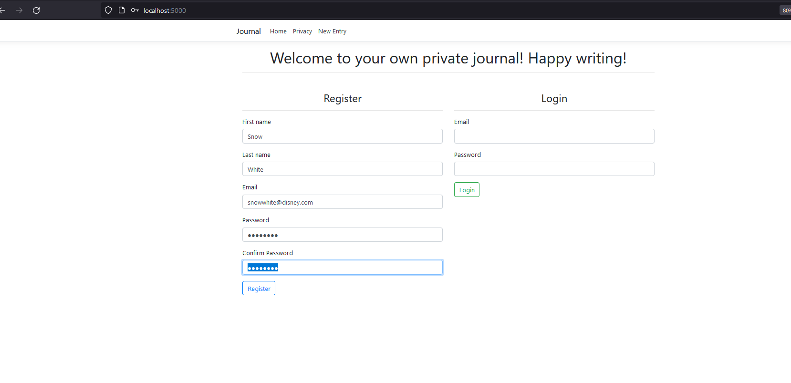
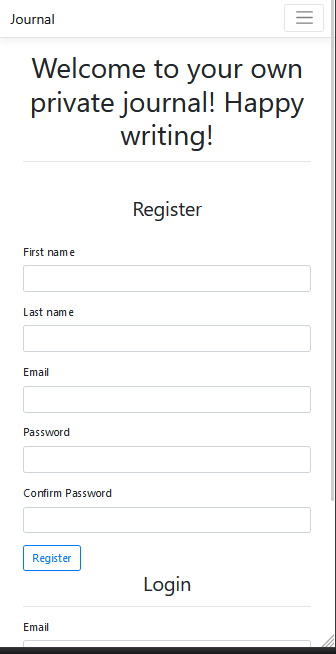
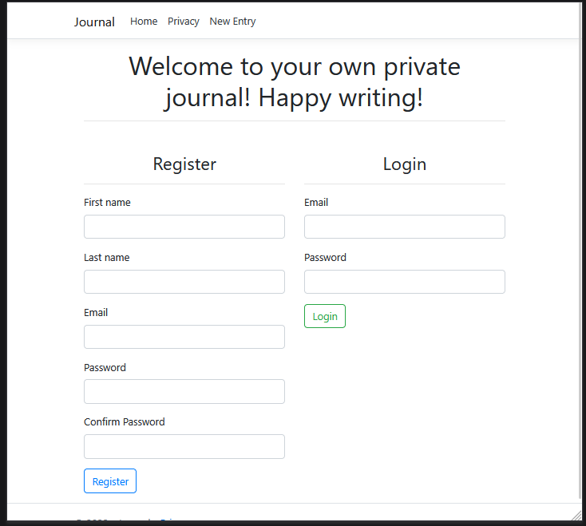
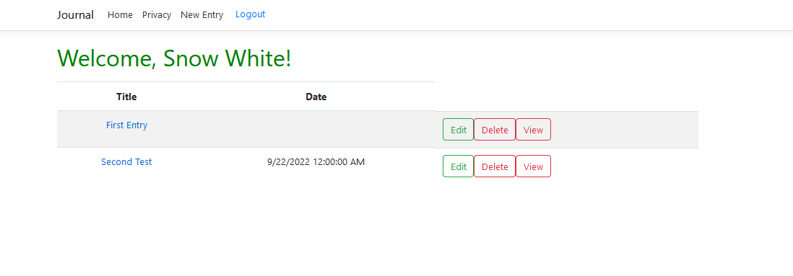
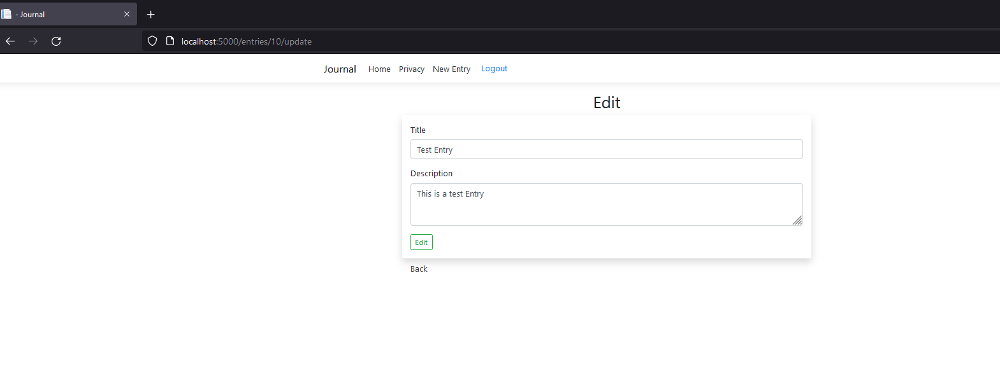
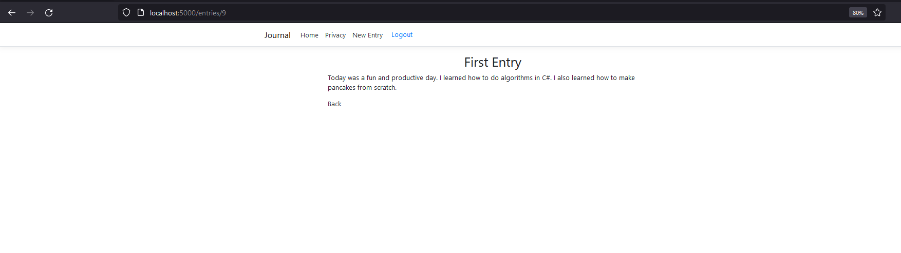
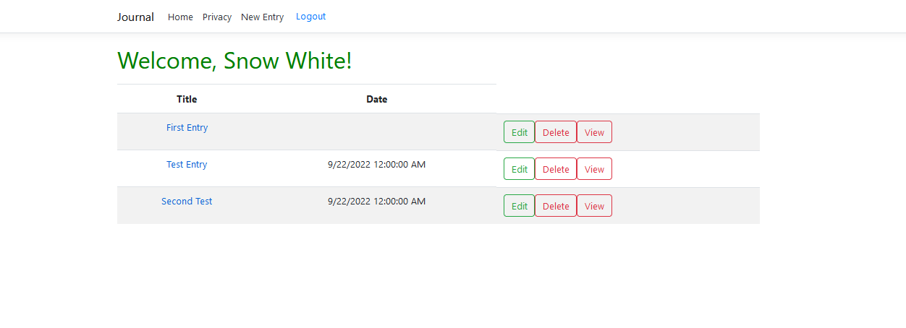
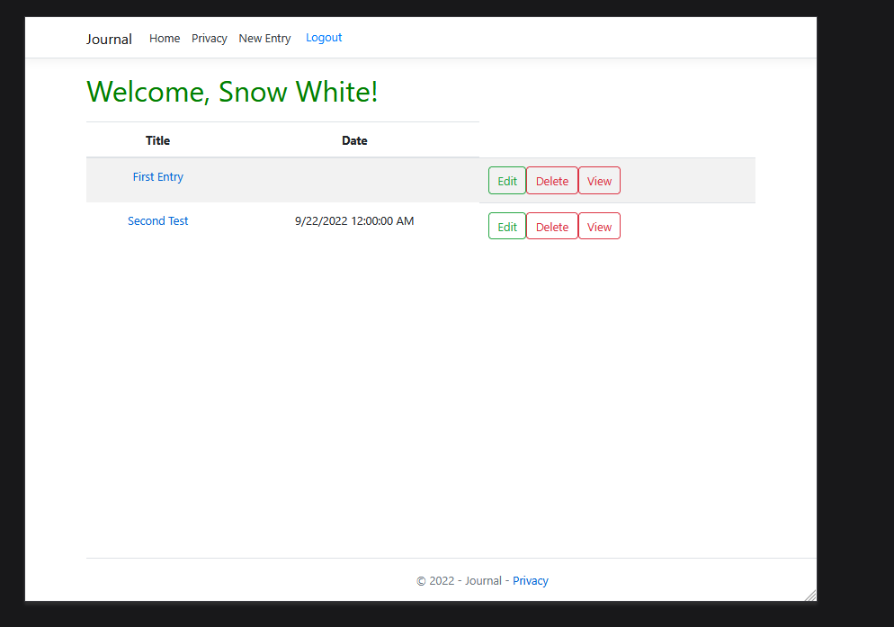

# Journal App
## Introduction

Journal is an online application where users can safely create, edit, and view private journal entries in blurb format. The app is designed with simplicity and ease of access for the user. Responsive design allows a wide range of view screens to easily view the app, including mobile devices. Data entry is secure and persisted using MySQL and served using a c# server and framework.

## Features

- Responsive layout design
- Mobile friendly views
- Personal accounts with password protection
- Create, read, update, and deletion of journal entries
- Persisted data
- Animations for ease of use

## Tech Stack

- .Net 5.0
- Asp.net 5.0
- C#
- Bootstrap
- MySQL
- Javascript, HTML, CSS

## Demo

## Local Instance Setup

The following instructions are for setting up a local instance to demo the app.
- Clone the repository
- Ensure you have an instance of MySql running.
- Edit your "appsettings.json" file to include the login information for your database instance.
    - Check for "DBInfo" property and ensure the "ConnectionString" is correct.
- You will need .net 5.0 installed before building the app.
- Using visual studio/code, follow the automatic build process after pressing run.
- The local instance will be served on "localhost:5000".
